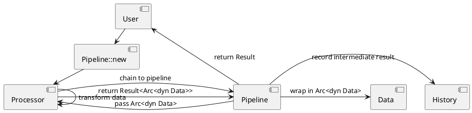
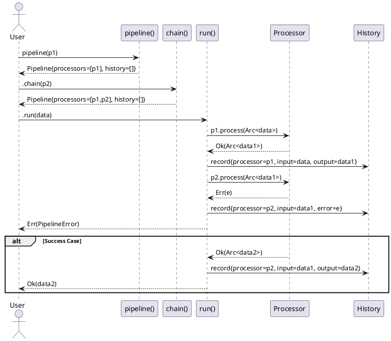
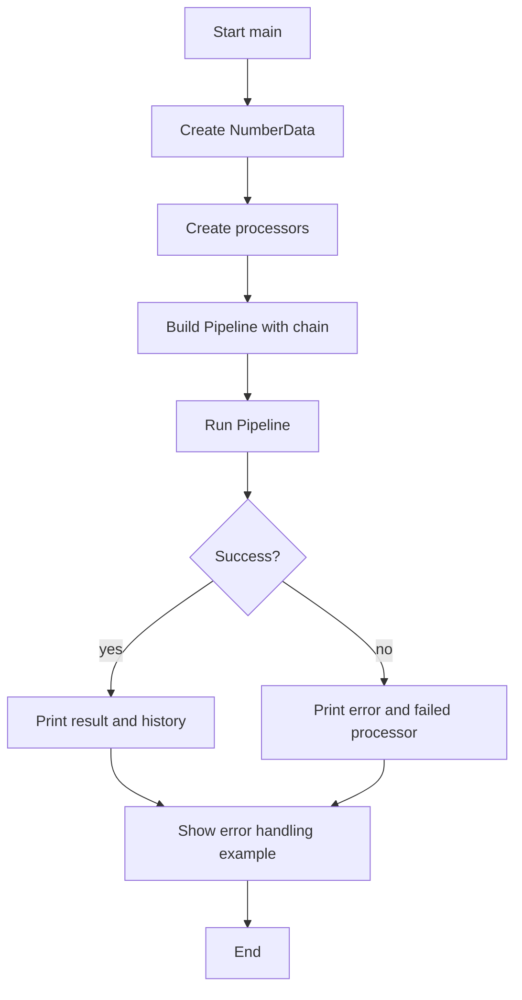

# PipelineDesign Design Document

## Part 1: Overall Architecture

### 1.1 Overview

**功能描述：**
实现一个函数式风格的Pipeline系统，用于单线程数据处理流。用户可以自由扩展Processor，数据通过`Arc<dyn Data>`智能指针传递，支持中间结果访问和错误短路终止。

**当前行为：**
项目目前只有一个空的main.rs，无任何Pipeline相关功能。

**目标行为：**
- 用户定义自定义Processor实现trait
- 通过函数式链式API组装Pipeline
- 执行时逐个processor处理数据
- 失败时立即终止，成功时可访问每个processor的输出

**风险级别：LOW**
- 新功能，不影响现有代码
- API设计清晰，易于测试
- 无外部依赖风险

### 1.2 Requirements

**Functional Requirements:**
- REQ-001: 用户可定义自定义Processor实现trait
- REQ-002: 支持函数式链式API组装Pipeline
- REQ-003: 数据通过`Arc<dyn Data>`传递
- REQ-004: 处理失败时立即终止并返回错误
- REQ-005: 可访问每个processor的中间处理结果
- REQ-006: Pipeline可在编译时或运行时组装

**Non-Functional Requirements:**
- 性能: 单次处理时间 < 10ms（无复杂业务逻辑）
- 扩展性: Processor接口简单，用户5分钟内可定义新processor
- 安全性: Arc确保数据安全共享
- 可读性: API符合Rust函数式编程习惯

**Constraints:**
- 平台: Rust编译器支持的所有平台
- 标准遵循: 遵循Rust trait object safety规则
- 单线程限制: 不考虑多线程并发场景

### 1.3 Module List

| Module | Responsibility | Owner/Area | Change Type |
|--------|----------------|------------|-------------|
| lib.rs | 库入口，导出公共API | public interface | new |
| data.rs | Data trait定义 | core abstraction | new |
| processor.rs | Processor trait定义 | core abstraction | new |
| pipeline.rs | Pipeline结构实现 | execution engine | new |
| error.rs | Error类型定义 | error handling | new |
| main.rs | 示例用法演示 | example | modified |

---

## Part 2: Overall Data Flow and Module Interaction

### 2.1 Data Flow Diagram



### 2.2 Interaction Sequence



### 2.3 Module Boundary Matrix

| Source Module | Target Module | Interaction Type | Data Contract | Description |
|---------------|---------------|------------------|---------------|-------------|
| lib.rs | all modules | export | public APIs | 导出所有公共trait和结构 |
| Pipeline | Processor | trait call | `Arc<dyn Data>` | Pipeline调用Processor的process方法 |
| Pipeline | Data | use | `Arc<dyn Data>` | Pipeline接收和传递Data trait对象 |
| Pipeline | Error | use | `Result<T, Error>` | Pipeline返回统一错误类型 |
| Processor | Data | use | `Arc<dyn Data>` | Processor处理Data trait对象 |
| Processor | Error | use | `Result<T, Error>` | Processor返回处理结果或错误 |
| User | Pipeline | API call | builder pattern | 用户通过chain()组装Pipeline |

### 2.4 Dependency Constraints

**Allowed Dependencies:**
- Pipeline → Processor (trait调用)
- Pipeline → Data (trait对象传递)
- Pipeline → Error (错误类型)
- Processor → Data (trait对象接收)
- Processor → Error (错误类型返回)
- 所有模块 → std::sync::Arc

**Forbidden Dependencies:**
- Processor之间禁止直接依赖（通过Pipeline间接调用）
- Data禁止依赖Processor或Pipeline
- Error禁止依赖任何业务模块

**Validation Method:**
- 通过Rust编译器类型系统验证依赖关系
- 通过cargo tree检查无循环依赖

---

## Part 3: Module Decomposition and Detailed Design

### Module: data.rs

#### 3.1 Module Overview

**业务边界：**
定义数据处理流中的数据抽象接口，作为所有processor之间传递的数据类型基础。

**数据边界：**
- 输入：无（定义抽象接口）
- 输出：`dyn Data` trait对象，可被任意具体数据类型实现

**行为边界：**
提供trait object安全的数据接口，支持运行时多态和Arc包装。

#### 3.2 Data Structures

**Public Data Structures:**
```rust
pub trait Data: Send + Sync {
    fn as_any(&self) -> &dyn Any;
    fn clone_data(&self) -> Arc<dyn Data>;
}
```

**Private Data Structures:**
无私有数据结构，该模块仅定义公共trait。

#### 3.3 Public Interfaces

#### Interface: Data trait

**1. Function Description:**
- 定义数据trait，作为pipeline中传递的数据类型抽象
- 支持运行时类型检查和克隆
- 确保trait object safety

**2. Use Cases:**

| Scenario | Description | Frequency |
|----------|-------------|-----------|
| Processor处理数据 | Processor接收Arc<dyn Data>并返回Arc<dyn Data> | High (100%) |
| 类型检查 | 用户通过as_any()检查具体类型 | Medium (调试时) |
| 数据克隆 | Processor需要保留原始数据时克隆 | Low (可选) |

**3. Business Logic:**
```
Step 1: as_any() -> 返回Any引用用于类型检查
Step 2: clone_data() -> 克隆数据为新的Arc<dyn Data>

Performance: O(1) for trait method calls
```

**4. Constraints:**

| Constraint | Value | Source | Impact |
|------------|-------|--------|--------|
| Trait Object Safety | 必须满足object safety规则 | Rust语言规范 | 不能有泛型方法、Self返回类型 |
| Send + Sync | 必须实现 | Arc<dyn Data>要求 | 支持多线程场景预留 |
| Arc包装 | 必须支持Arc包装 | REQ-003 | 用户使用Arc<dyn Data>传递数据 |

**5. Parameters:**

Trait方法无参数，仅定义行为接口。

**6. Return Values:**

| Method | Return Type | Description | Constraint |
|-------|------|-------------|------------|
| as_any() | &dyn Any | 用于类型检查的引用 | 必须返回self引用 |
| clone_data() | Arc<dyn Data> | 克隆后的数据 | 必须返回新Arc |

**7. Exceptions:**

Trait方法不返回错误，仅定义行为。

**8. Usage Examples:**
```rust
// Example 1: 定义自定义数据类型
struct MyData {
    value: i32,
}

impl Data for MyData {
    fn as_any(&self) -> &dyn Any {
        self
    }
    
    fn clone_data(&self) -> Arc<dyn Data> {
        Arc::new(MyData { value: self.value })
    }
}

// Example 2: 类型检查
let data: Arc<dyn Data> = Arc::new(MyData { value: 42 });
if let Some(my_data) = data.as_any().downcast_ref::<MyData>() {
    println!("Value: {}", my_data.value);
}
```

---

### Module: processor.rs

#### 3.1 Module Overview

**业务边界：**
定义处理单元的抽象接口，用户通过实现此trait来扩展pipeline的处理能力。

**数据边界：**
- 输入：`Arc<dyn Data>`（待处理的数据）
- 输出：`Result<Arc<dyn Data>, PipelineError>`（处理后的数据或错误）

**行为边界：**
每个processor负责单一的数据转换逻辑，失败时返回错误触发pipeline短路终止。

#### 3.2 Data Structures

**Public Data Structures:**
```rust
pub trait Processor: Send + Sync {
    fn name(&self) -> &str;
    fn process(&self, data: Arc<dyn Data>) -> Result<Arc<dyn Data>, PipelineError>;
}
```

**Private Data Structures:**
无，仅定义公共trait。

#### 3.3 Public Interfaces

#### Interface: Processor trait

**1. Function Description:**
- 定义处理单元接口，接收数据并返回处理结果或错误
- 支持trait object和Arc包装
- 用户实现此trait来定义自定义处理逻辑
- 提供name()方法用于历史记录和调试

**2. Use Cases:**

| Scenario | Description | Frequency |
|----------|-------------|-----------|
| 数据转换 | 转换数据格式或内容 | High (主要用途) |
| 数据验证 | 验证数据是否符合规则 | Medium (可选) |
| 数据过滤 | 过滤不符合条件的数据 | Low (可选) |

**3. Business Logic:**
```
Step 1: 接收 Arc<dyn Data>
Step 2: 执行处理逻辑（用户自定义）
Step 3: 返回 Result<Arc<dyn Data>, PipelineError>
        - 成功：返回新的Arc<dyn Data>
        - 失败：返回PipelineError，触发短路终止

Performance: O(n) where n = 处理逻辑复杂度（用户控制）
```

**4. Constraints:**

| Constraint | Value | Source | Impact |
|------------|-------|--------|--------|
| Trait Object Safety | 必须满足object safety | Rust语言规范 | 不能有泛型参数 |
| Send + Sync | 必须实现 | REQ-006 | 支持动态组装 |
| 错误返回 | 必须返回PipelineError | REQ-004 | 错误短路终止 |
| Arc输入输出 | 必须使用Arc<dyn Data> | REQ-003 | 统一数据传递方式 |

**5. Parameters:**

Trait methods:

| Method | Parameter | Type | Required | Description | Constraint | Default |
|--------|-----------|------|----------|-------------|------------|---------|
| name() | - | - | - | 返回processor名称 | 无参数，返回&str | - |
| process() | data | Arc<dyn Data> | ✅ | 待处理的数据 | 必须是Arc包装的Data trait对象 | - |

**6. Return Values:**

| Method | Return Type | Description | Constraint |
|--------|------|-------------|------------|
| name() | &str | Processor名称 | 用于历史记录和调试 |
| process() | Ok(Arc<dyn Data>) | 处理成功的数据 | 必须是新的Arc<dyn Data> |
| process() | Err(PipelineError) | 处理失败的错误 | 必须是PipelineError类型 |

**7. Exceptions:**

| Exception Type | Trigger Condition | Handling | HTTP Status |
|----------------|-------------------|----------|-------------|
| ValidationError | 数据不符合处理要求 | 返回给Pipeline，终止执行 | N/A (内部错误) |
| TransformError | 转换逻辑失败 | 返回给Pipeline，终止执行 | N/A (内部错误) |
| CustomError | 用户自定义错误 | 返回给Pipeline，终止执行 | N/A (内部错误) |

**8. Usage Examples:**
```rust
// Example 1: 数据转换processor
struct IncrementProcessor;

impl Processor for IncrementProcessor {
    fn name(&self) -> &str {
        "IncrementProcessor"
    }
    
    fn process(&self, data: Arc<dyn Data>) -> Result<Arc<dyn Data>, PipelineError> {
        if let Some(num) = data.as_any().downcast_ref::<NumberData>() {
            Ok(Arc::new(NumberData { value: num.value + 1 }))
        } else {
            Err(PipelineError::TypeError("Expected NumberData"))
        }
    }
}

// Example 2: 数据验证processor
struct ValidateProcessor {
    min_value: i32,
}

impl Processor for ValidateProcessor {
    fn name(&self) -> &str {
        "ValidateProcessor"
    }
    
    fn process(&self, data: Arc<dyn Data>) -> Result<Arc<dyn Data>, PipelineError> {
        if let Some(num) = data.as_any().downcast_ref::<NumberData>() {
            if num.value >= self.min_value {
                Ok(data.clone_data())
            } else {
                Err(PipelineError::ValidationError("Value too small"))
            }
        } else {
            Err(PipelineError::TypeError("Expected NumberData"))
        }
    }
}

// Example 3: 使用processor
let processor = IncrementProcessor;
let data: Arc<dyn Data> = Arc::new(NumberData { value: 42 });
let result = processor.process(data)?;
println!("Processor name: {}", processor.name());
```

---

### Module: error.rs

#### 3.1 Module Overview

**业务边界：**
定义统一的错误类型，用于Pipeline和Processor的错误处理和传递。

**数据边界：**
- 输入：各种错误场景（类型错误、验证错误、处理错误等）
- 输出：PipelineError enum，包含详细错误信息

**行为边界：**
提供错误类型定义、错误消息和错误来源追踪。

#### 3.2 Data Structures

**Public Data Structures:**
```rust
pub enum PipelineError {
    TypeError(String),
    ValidationError(String),
    ProcessingError(String),
    EmptyPipeline,
}

impl std::fmt::Display for PipelineError {
    fn fmt(&self, f: &mut std::fmt::Formatter) -> std::fmt::Result {
        match self {
            PipelineError::TypeError(msg) => write!(f, "Type error: {}", msg),
            PipelineError::ValidationError(msg) => write!(f, "Validation error: {}", msg),
            PipelineError::ProcessingError(msg) => write!(f, "Processing error: {}", msg),
            PipelineError::EmptyPipeline => write!(f, "Pipeline has no processors"),
        }
    }
}

impl std::error::Error for PipelineError {}
```

**Private Data Structures:**
无，仅定义公共错误类型。

#### 3.3 Public Interfaces

#### Interface: PipelineError enum

**1. Function Description:**
- 定义Pipeline处理过程中可能出现的所有错误类型
- 实现Display和Error trait用于错误消息和错误链
- 支持用户自定义错误消息

**2. Use Cases:**

| Scenario | Description | Frequency |
|----------|-------------|-----------|
| Processor失败 | Processor处理失败时返回错误 | High (错误场景) |
| Pipeline错误 | Pipeline执行过程中的错误 | Medium (配置错误) |
| 用户错误处理 | 用户捕获和处理错误 | High (必需) |

**3. Business Logic:**
```
错误类型分类：
- TypeError: 数据类型不匹配
- ValidationError: 数据验证失败
- ProcessingError: 处理逻辑错误
- EmptyPipeline: Pipeline无processor

Display实现：提供友好的错误消息
Error实现：支持错误链和标准错误处理
```

**4. Constraints:**

| Constraint | Value | Source | Impact |
|------------|-------|--------|--------|
| 错误类型覆盖 | 必须覆盖所有错误场景 | REQ-004 | 所有错误统一处理 |
| Display trait | 必须实现 | Rust标准库 | 错误消息友好 |
| Error trait | 必须实现 | Rust标准库 | 支持错误链 |
| 错误消息清晰 | 必须提供详细消息 | 可读性要求 | 易于调试 |

**5. Parameters:**

Enum变体参数：
- TypeError(String) - 类型错误消息
- ValidationError(String) - 验证错误消息
- ProcessingError(String) - 处理错误消息
- EmptyPipeline - 无参数

**6. Return Values:**

| Variant | Data | Description | Constraint |
|---------|------|-------------|------------|
| TypeError | String | 类型错误详细消息 | 必须包含期望类型和实际类型 |
| ValidationError | String | 验证失败详细消息 | 必须包含验证规则和失败原因 |
| ProcessingError | String | 处理错误详细消息 | 必须包含错误原因 |
| EmptyPipeline | - | Pipeline为空 | 无参数 |

**7. Exceptions:**

错误类型本身不抛出异常，仅用于表示错误状态。

**8. Usage Examples:**
```rust
// Example 1: 创建类型错误
let error = PipelineError::TypeError("Expected NumberData, got StringData");

// Example 2: 创建验证错误
let error = PipelineError::ValidationError("Value must be >= 10, got 5");

// Example 3: 错误处理
match processor.process(data) {
    Ok(result) => println!("Success: {:?}", result),
    Err(PipelineError::TypeError(msg)) => println!("Type error: {}", msg),
    Err(PipelineError::ValidationError(msg)) => println!("Validation error: {}", msg),
    Err(PipelineError::ProcessingError(msg)) => println!("Processing error: {}", msg),
    Err(PipelineError::EmptyPipeline) => println!("Pipeline is empty"),
}

// Example 4: 错误传播
fn run_pipeline(data: Arc<dyn Data>) -> Result<Arc<dyn Data>, PipelineError> {
    let processor1 = Processor1;
    let result1 = processor1.process(data)?;
    let processor2 = Processor2;
    processor2.process(result1)?
}
```

---

### Module: pipeline.rs

#### 3.1 Module Overview

**业务边界：**
Pipeline的核心实现，负责管理processor链、执行数据流、记录处理历史。

**数据边界：**
- 输入：processor列表、初始数据
- 输出：最终处理结果、中间处理历史

**行为边界：**
- 支持函数式链式API组装processor
- 执行时逐个调用processor处理数据
- 失败时立即终止（短路）
- 记录每个processor的输入输出用于中间结果访问

#### 3.2 Data Structures

**Public Data Structures:**
```rust
pub struct ProcessorRecord {
    processor_name: String,  // 通过 processor.name() 获取
    input: Arc<dyn Data>,
    output: Option<Arc<dyn Data>>,
    error: Option<PipelineError>,
}

pub struct Pipeline {
    processors: Vec<Arc<dyn Processor>>,
    history: Vec<ProcessorRecord>,
}
```

**Private Data Structures:**
无，所有数据结构为公共接口。

#### 3.3 Public Interfaces

#### Interface: pipeline() - 创建函数

**1. Function Description:**
- 工厂函数，创建包含单个processor的Pipeline
- 函数式API的起点
- 初始化空的处理历史

**2. Use Cases:**

| Scenario | Description | Frequency |
|----------|-------------|-----------|
| 创建Pipeline | 用户开始构建处理链 | High (每次使用) |
| 单processor场景 | 只需要一个processor时 | Medium (简单场景) |

**3. Business Logic:**
```
Step 1: 接收 processor
Step 2: 包装为 Arc<dyn Processor>
Step 3: 创建 Pipeline { processors: [processor], history: [] }
Step 4: 返回 Pipeline

Performance: O(1)
```

**4. Constraints:**

| Constraint | Value | Source | Impact |
|------------|-------|--------|--------|
| Processor数量 | 至少1个 | REQ-001 | 不能创建空Pipeline |
| Arc包装 | 必须Arc包装 | REQ-003 | 支持共享 |

**5. Parameters:**

| Parameter | Type | Required | Description | Constraint | Default |
|-----------|------|----------|-------------|------------|---------|
| processor | Arc<dyn Processor> | ✅ | 第一个processor | 必须实现Processor trait | - |

**6. Return Values:**

| Field | Type | Description | Constraint |
|-------|------|-------------|------------|
| Pipeline | struct | 包含单个processor的Pipeline | history为空 |

**7. Exceptions:**

不抛出异常，成功创建Pipeline。

**8. Usage Examples:**
```rust
// Example 1: 创建Pipeline
let p1 = Arc::new(IncrementProcessor);
let pipeline = pipeline(p1);

// Example 2: 使用自定义processor
let validator = Arc::new(ValidateProcessor { min_value: 10 });
let pipeline = pipeline(validator);
```

---

#### Interface: chain() - 链式添加

**1. Function Description:**
- 向Pipeline添加新的processor
- 返回新的Pipeline（函数式风格）
- 不修改原Pipeline（immutable）

**2. Use Cases:**

| Scenario | Description | Frequency |
|----------|-------------|-----------|
| 组装处理链 | 用户添加多个processor | High (主要用途) |
| 动态扩展 | 运行时添加processor | Medium (可选) |

**3. Business Logic:**
```
Step 1: 接收新processor
Step 2: 克隆现有processors列表
Step 3: 添加新processor到列表末尾
Step 4: 创建新Pipeline { processors: new_list, history: [] }
Step 5: 返回新Pipeline

Performance: O(n) where n = processors.len()
```

**4. Constraints:**

| Constraint | Value | Source | Impact |
|------------|-------|--------|--------|
| Immutable | 不修改原Pipeline | 函数式风格 | 每次chain返回新Pipeline |
| 执行顺序 | 添加顺序即为执行顺序 | REQ-002 | 先add先执行 |

**5. Parameters:**

| Parameter | Type | Required | Description | Constraint | Default |
|-----------|------|----------|-------------|------------|---------|
| self | &Pipeline | ✅ | 当前Pipeline | immutable引用 | - |
| processor | Arc<dyn Processor> | ✅ | 新processor | 必须实现Processor trait | - |

**6. Return Values:**

| Field | Type | Description | Constraint |
|-------|------|-------------|------------|
| Pipeline | struct | 包含新processor的Pipeline | history为空，processors增加 |

**7. Exceptions:**

不抛出异常，成功返回新Pipeline。

**8. Usage Examples:**
```rust
// Example 1: 链式添加
let p1 = Arc::new(IncrementProcessor);
let p2 = Arc::new(ValidateProcessor { min_value: 10 });
let pipeline = pipeline(p1).chain(p2);

// Example 2: 多级链式
let p1 = Arc::new(Processor1);
let p2 = Arc::new(Processor2);
let p3 = Arc::new(Processor3);
let pipeline = pipeline(p1).chain(p2).chain(p3);
```

---

#### Interface: run() - 执行处理

**1. Function Description:**
- 执行整个Pipeline处理链
- 逐个调用processor处理数据
- 失败时立即终止（短路）
- 记录处理历史用于中间结果访问

**2. Use Cases:**

| Scenario | Description | Frequency |
|----------|-------------|-----------|
| 执行处理 | 用户运行Pipeline处理数据 | High (主要用途) |
| 错误处理 | 处理失败时捕获错误 | Medium (错误场景) |

**3. Business Logic:**
```
Step 1: 检查processors是否为空（EmptyPipeline错误）
Step 2: 初始化history为空列表
Step 3: 设置current_data = input_data
Step 4: For each processor in processors:
        - 获取 processor_name = processor.name()
        - 记录 ProcessorRecord { processor_name, input: current_data, output: None, error: None }
        - 调用 processor.process(current_data)
        - If Ok(result):
            * 更新history record的output = result
            * current_data = result
        - If Err(error):
            * 更新history record的error = error
            * return Err(error)（短路终止）
Step 5: 返回 Ok(current_data)（最终结果）

Performance: O(n) where n = processors数量
```

**4. Constraints:**

| Constraint | Value | Source | Impact |
|------------|-------|--------|--------|
| 短路终止 | 失败时立即终止 | REQ-004 | 不继续执行后续processor |
| 历史记录 | 记录每个processor的处理结果 | REQ-005 | 支持中间结果访问 |
| 执行顺序 | 按添加顺序执行 | REQ-002 | FIFO顺序 |

**5. Parameters:**

| Parameter | Type | Required | Description | Constraint | Default |
|-----------|------|----------|-------------|------------|---------|
| self | &mut Pipeline | ✅ | Pipeline实例 | mutable引用（修改history） | - |
| data | Arc<dyn Data> | ✅ | 输入数据 | 必须是Arc<dyn Data> | - |

**6. Return Values:**

| Field | Type | Description | Constraint |
|-------|------|-------------|------------|
| Ok | Arc<dyn Data> | 最终处理结果 | 最后一个processor的输出 |
| Err | PipelineError | 处理错误 | 失败的processor返回的错误 |

**7. Exceptions:**

| Exception Type | Trigger Condition | Handling | HTTP Status |
|----------------|-------------------|----------|-------------|
| EmptyPipeline | processors列表为空 | 返回EmptyPipeline错误 | N/A |
| TypeError | processor返回TypeError | 立即终止，返回错误 | N/A |
| ValidationError | processor返回ValidationError | 立即终止，返回错误 | N/A |
| ProcessingError | processor返回ProcessingError | 立即终止，返回错误 | N/A |

**8. Usage Examples:**
```rust
// Example 1: 正常执行
let p1 = Arc::new(IncrementProcessor);
let p2 = Arc::new(ValidateProcessor { min_value: 10 });
let mut pipeline = pipeline(p1).chain(p2);

let data: Arc<dyn Data> = Arc::new(NumberData { value: 42 });
let result = pipeline.run(data)?;
println!("Result: {:?}", result);

// Example 2: 错误处理
let data: Arc<dyn Data> = Arc::new(NumberData { value: 5 });
match pipeline.run(data) {
    Ok(result) => println!("Success"),
    Err(PipelineError::ValidationError(msg)) => {
        println!("Validation failed: {}", msg);
        for record in &pipeline.history {
            println!("Processor: {}", record.processor_name);
        }
    }
    Err(e) => println!("Other error: {}", e),
}

// Example 3: 访问历史
let mut pipeline = pipeline(p1).chain(p2);
let data = Arc::new(NumberData { value: 42 });
pipeline.run(data)?;

for record in &pipeline.history {
    println!("Processor: {}", record.processor_name);
    if let Some(output) = &record.output {
        println!("Output: {:?}", output);
    }
}
```

---

#### Interface: history() - 访问历史

**1. Function Description:**
- 返回处理历史记录列表
- 用于访问每个processor的中间处理结果
- 支持调试和监控

**2. Use Cases:**

| Scenario | Description | Frequency |
|----------|-------------|-----------|
| 调试 | 查看每个processor的处理结果 | High (REQ-005) |
| 监控 | 记录处理流程 | Medium (可选) |
| 错误分析 | 分析失败原因 | Medium (错误场景) |

**3. Business Logic:**
```
Step 1: 返回history列表的引用
Step 2: 用户遍历history访问每个ProcessorRecord

Performance: O(1)
```

**4. Constraints:**

| Constraint | Value | Source | Impact |
|------------|-------|--------|--------|
| 历史完整性 | 记录所有processor的处理结果 | REQ-005 | 包括失败的processor |
| 只读访问 | 返回不可变引用 | 安全性 | 用户不能修改历史 |

**5. Parameters:**

| Parameter | Type | Required | Description | Constraint | Default |
|-----------|------|----------|-------------|------------|---------|
| self | &Pipeline | ✅ | Pipeline实例 | immutable引用 | - |

**6. Return Values:**

| Field | Type | Description | Constraint |
|-------|------|-------------|------------|
| Vec<ProcessorRecord> | slice | 处理历史记录 | 包含所有processor的记录 |

**7. Exceptions:**

不抛出异常，成功返回历史记录。

**8. Usage Examples:**
```rust
// Example 1: 查看所有历史
let mut pipeline = pipeline(p1).chain(p2);
let data = Arc::new(NumberData { value: 42 });
pipeline.run(data)?;

for record in pipeline.history() {
    println!("Processor: {}", record.processor_name);
    println!("Input: {:?}", record.input);
    if let Some(output) = &record.output {
        println!("Output: {:?}", output);
    }
}

// Example 2: 错误场景查看历史
let data = Arc::new(NumberData { value: 5 });
if let Err(_) = pipeline.run(data) {
    for record in pipeline.history() {
        if let Some(error) = &record.error {
            println!("Failed at processor: {}", record.processor_name);
            println!("Error: {:?}", error);
        }
    }
}
```

---

### Module: lib.rs

#### 3.1 Module Overview

**业务边界：**
库的公共API入口，导出所有公共trait、结构和函数。

**数据边界：**
- 无数据处理，仅模块导出
- 组织公共API供用户使用

**行为边界：**
提供清晰的模块结构和文档，用户通过lib.rs访问所有功能。

#### 3.2 Data Structures

**Public Data Structures:**
无数据结构，仅模块导出声明。

**Private Data Structures:**
无。

#### 3.3 Public Interfaces

#### Interface: module exports

**1. Function Description:**
- 导出所有公共API供用户使用
- 提供清晰的模块结构
- 包含库级别文档注释

**2. Use Cases:**

| Scenario | Description | Frequency |
|----------|-------------|-----------|
| 用户导入库 | 用户使用use pipeline::* | High (每次使用) |
| API发现 | 用户查看可用API | High (首次使用) |
| 文档查看 | 用户查看库文档 | Medium (学习阶段) |

**3. Business Logic:**
```
导出结构：
- pub use data::Data;
- pub use processor::Processor;
- pub use pipeline::{Pipeline, ProcessorRecord, pipeline, chain, run, history};
- pub use error::PipelineError;

模块组织：
mod data;
mod processor;
mod pipeline;
mod error;

文档注释：
//! Pipeline库 - 函数式数据处理流
//! 
//! 提供可扩展的processor链式调用系统
//! 支持中间结果访问和错误短路终止
```

**4. Constraints:**

| Constraint | Value | Source | Impact |
|------------|-------|--------|--------|
| API可见性 | 所有核心trait和结构为public | REQ-001 | 用户可访问所有功能 |
| 文档完整性 | 必须提供模块级文档 | 可读性要求 | cargo doc支持 |
| 导出清晰 | 仅导出必要API | API设计原则 | 避免暴露内部实现 |

**5. Parameters:**

无参数，模块导出声明。

**6. Return Values:**

导出的公共API：
- Data trait（包含 as_any(), clone_data() 方法）
- Processor trait（包含 name(), process() 方法）  
- Pipeline struct
- ProcessorRecord struct
- pipeline() 函数
- chain() 方法（通过Pipeline）
- run() 方法（通过Pipeline）
- history() 方法（通过Pipeline）
- PipelineError enum

**7. Exceptions:**

不抛出异常，模块导出声明。

**8. Usage Examples:**
```rust
// Example 1: 导入库
use pipeline::{Data, Processor, Pipeline, PipelineError};

// Example 2: 定义自定义数据
struct MyData { value: i32 }
impl Data for MyData { ... }

// Example 3: 定义自定义processor
struct MyProcessor;
impl Processor for MyProcessor { ... }

// Example 4: 使用Pipeline
let p = Arc::new(MyProcessor);
let mut pipeline = pipeline(p);
let data = Arc::new(MyData { value: 42 });
let result = pipeline.run(data)?;
```

---

### Module: main.rs

#### 3.1 Module Overview

**业务边界：**
演示Pipeline库的使用方法，提供完整的示例代码。

**数据边界：**
- 创建示例数据和processor
- 执行Pipeline并展示结果

**行为边界：**
展示Pipeline的核心功能：链式组装、执行处理、中间结果访问、错误处理。

#### 3.2 Data Structures

**Public Data Structures:**
无（main.rs为示例代码，不导出API）。

**Private Data Structures:**
示例用的自定义数据类型和processor实现。

#### 3.3 Public Interfaces

无公共接口，main.rs仅包含示例代码。

#### 3.4 Module Internal Design

##### 3.4.1 Private Data and State

```rust
// 示例数据类型
struct NumberData {
    value: i32,
}

impl Data for NumberData {
    fn as_any(&self) -> &dyn Any {
        self
    }
    
    fn clone_data(&self) -> Arc<dyn Data> {
        Arc::new(NumberData { value: self.value })
    }
}

// 示例processor
struct IncrementProcessor;

impl Processor for IncrementProcessor {
    fn name(&self) -> &str { "IncrementProcessor" }
    fn process(&self, data: Arc<dyn Data>) -> Result<Arc<dyn Data>, PipelineError> { ... }
}

struct ValidateProcessor { min_value: i32 }

impl Processor for ValidateProcessor {
    fn name(&self) -> &str { "ValidateProcessor" }
    fn process(&self, data: Arc<dyn Data>) -> Result<Arc<dyn Data>, PipelineError> { ... }
}

struct MultiplyProcessor { factor: i32 }

impl Processor for MultiplyProcessor {
    fn name(&self) -> &str { "MultiplyProcessor" }
    fn process(&self, data: Arc<dyn Data>) -> Result<Arc<dyn Data>, PipelineError> { ... }
}
```

##### 3.4.2 Implementation Logic



##### 3.4.3 Test Strategy

| REQ-ID | Test Type | Test File/Command | Expected Evidence |
|--------|-----------|-------------------|-------------------|
| REQ-001 | Integration | cargo run | NumberData和processor实现成功 |
| REQ-002 | Integration | cargo run | 链式API成功组装Pipeline |
| REQ-003 | Integration | cargo run | Arc<dyn Data>正确传递 |
| REQ-004 | Integration | cargo run | 错误场景短路终止 |
| REQ-005 | Integration | cargo run | history访问成功 |

##### 3.4.4 Peripheral Module Dependencies

无外部依赖，仅依赖lib.rs导出的Pipeline库API。

---

## Part 4: Integration and Verification

### 4.1 Integration Points

**内部集成点：**
- lib.rs → data.rs, processor.rs, pipeline.rs, error.rs（模块导出）
- Pipeline → Processor（trait调用）
- Pipeline → Data（trait对象传递）
- Pipeline → Error（错误类型）

**外部集成点：**
- 用户代码 → lib.rs（通过use导入）
- main.rs → lib.rs（示例演示）

**无第三方依赖：**
- 仅依赖Rust标准库
- 无额外cargo依赖

### 4.2 Implementation Plan

**开发顺序：**
1. **error.rs** - 基础错误类型，其他模块依赖
2. **data.rs** - Data trait定义，Processor依赖
3. **processor.rs** - Processor trait定义，Pipeline依赖
4. **pipeline.rs** - 核心执行引擎，依赖上述所有模块
5. **lib.rs** - 导出公共API，依赖所有模块
6. **main.rs** - 示例演示，最后实现

**关键路径：**
error → data → processor → pipeline → lib

**并行机会：**
- error.rs可独立开发
- data.rs和error.rs可并行开发（data不依赖error）
- processor.rs依赖data和error，需等待
- pipeline.rs依赖所有基础模块，需等待

### 4.3 Verification Checklist

| REQ-ID | Verification Item | Test Method | Verification Criteria |
|--------|-------------------|-------------|----------------------|
| REQ-001 | 用户可定义Processor | 在main.rs实现自定义processor | 编译成功，trait实现完整 |
| REQ-002 | 函数式链式API | main.rs使用chain()组装 | pipeline(p1).chain(p2).chain(p3)成功 |
| REQ-003 | Arc<dyn Data>传递 | processor使用Arc<dyn Data> | 类型检查通过，Arc克隆成功 |
| REQ-004 | 错误短路终止 | 验证processor返回错误 | 后续processor不执行，错误返回 |
| REQ-005 | 中间结果访问 | 访问pipeline.history() | 每个processor的输入输出可见 |
| REQ-006 | 动态组装 | 运行时添加processor | chain()可在运行时调用 |

**验证命令：**
```bash
cargo build      # 编译验证
cargo run        # 功能验证（示例运行）
cargo test       # 单元测试（如需要）
cargo doc        # 文档验证
```

### 4.4 Change Impact Analysis

**影响矩阵：**

| Change | Affected Module | Impact | Risk |
|--------|-----------------|--------|------|
| 新增Data trait | processor.rs, pipeline.rs | 需使用Arc<dyn Data> | LOW |
| 新增Processor trait | pipeline.rs, main.rs | pipeline调用processor.process() | LOW |
| 新增PipelineError | processor.rs, pipeline.rs | 错误返回类型 | LOW |
| 新增Pipeline结构 | main.rs | 用户组装和执行 | LOW |
| 修改main.rs | 无影响 | 示例代码，不影响库 | LOW |

**风险缓解策略：**
- 所有新增模块，无修改现有代码 → 风险极低
- 编译器类型系统保证API正确性
- cargo test验证单元测试通过
- cargo run验证示例功能正常

**回滚考虑：**
- 所有文件新增，删除即可回滚
- Cargo.toml无依赖变更
- 无数据库或配置变更
- 回滚成本：删除5个新增文件即可