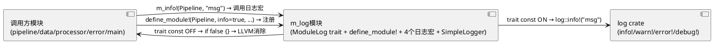
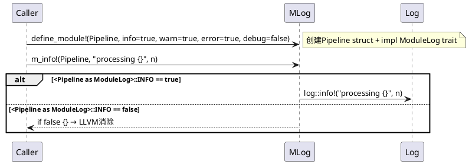
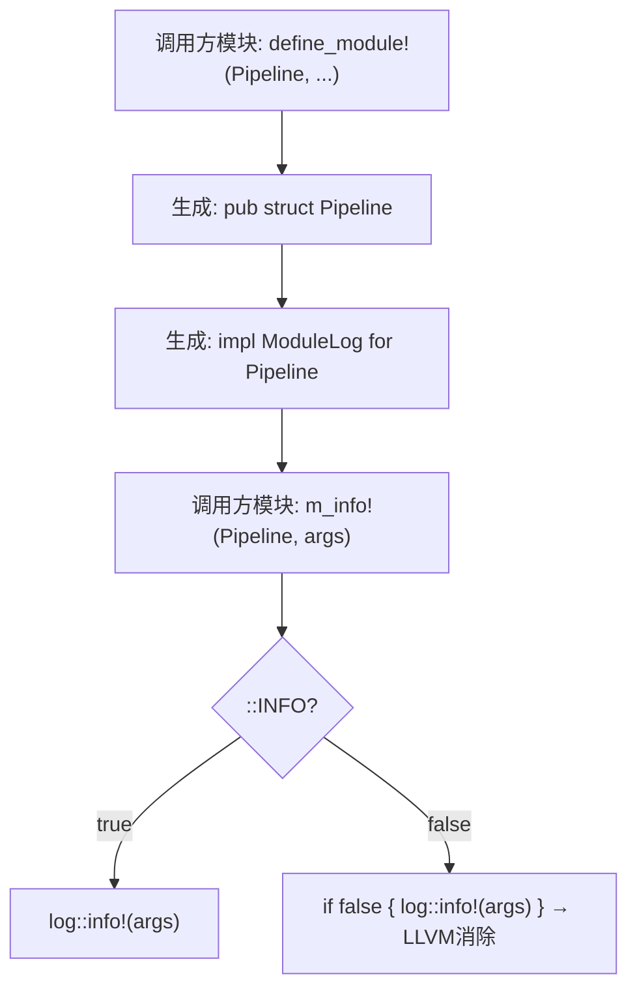

# 日志过滤 Design Document (Revised)

## Part 1: Overall Architecture

### 1.1 Overview

- Feature description: 提供模块无关的通用日志过滤基础设施m_log，调用方模块通过define_module!宏注册后，使用m_info!/m_warn!/m_error!/m_debug!宏输出日志，根据注册的const bool开关决定转发log crate或空跑
- Current behavior: 所有模块使用println!输出日志，无过滤控制
- Target behavior: 各模块向m_log注册（define_module!），调用m_log宏替代println!
- Risk level: LOW

### 1.2 Requirements

- REQ-001: m_log定义ModuleLog trait（含const bool: INFO/WARN/ERROR/DEBUG），作为注册接口
- REQ-002: m_log提供define_module!宏，调用方模块使用此宏创建trait实现
- REQ-003: m_log提供m_info!/m_warn!/m_error!/m_debug!四个宏
- REQ-004: 宏展开为 `if <Module as ModuleLog>::LEVEL { log::level!(...) }`
- REQ-005: 开关关闭时零运行时开销（LLVM消除死分支）
- REQ-006: 开关启用时宏展开为log crate宏调用
- REQ-007: 替换现有代码中所有println!为m_log宏
- REQ-008: m_log实现SimpleLogger，代码仅含通用模块无关逻辑
- REQ-009: m_log不含任何业务模块硬编码引用

### 1.3 Module List

| Module | Responsibility | Owner/Area | Change Type |
|--------|----------------|------------|-------------|
| m_log | 通用日志过滤基础设施（trait+宏+logger） | logging | new (revised) |
| pipeline | Pipeline处理链 | core | modified |
| data | Data trait定义 | core | modified |
| processor | Processor trait定义 | core | modified |
| error | PipelineError定义 | core | modified |
| main | 入口示例 | demo | modified |
| lib | 库入口 | core | modified |

---

## Part 2: Overall Data Flow and Module Interaction

### 2.1 Data Flow Diagram



### 2.2 Interaction Sequence



### 2.3 Module Boundary Matrix

| Source Module | Target Module | Interaction Type | Data Contract | Description |
|---------------|---------------|------------------|---------------|-------------|
| pipeline | m_log | define_module!注册 + m_info!调用 | ModuleLog trait impl | 注册后调用日志宏 |
| data | m_log | define_module!注册 + m_info!调用 | ModuleLog trait impl | 同上 |
| processor | m_log | define_module!注册 + m_info!调用 | ModuleLog trait impl | 同上 |
| error | m_log | define_module!注册 + m_error!调用 | ModuleLog trait impl | 同上 |
| main | m_log | define_module!注册 + m_info!/m_error!调用 + init() | ModuleLog trait impl + logger init | 注册+初始化+日志 |
| m_log | log | macro forwarding | log crate宏调用 | trait const ON时转发 |

### 2.4 Dependency Constraints

- Allowed: 所有模块 → m_log（单向依赖）
- Allowed: m_log → log crate（单向依赖）
- Allowed: main → m_log::init（初始化logger）
- Forbidden: m_log → 任何业务模块（m_log代码模块无关）
- Forbidden: 业务模块之间通过m_log产生耦合
- Validation: m_log.rs中不应包含任何模块名硬编码（如Pipeline/Data等）

---

## Part 3: Module Decomposition and Detailed Design

### Module: m_log

#### 3.1 Module Overview

- Business boundary: m_log是横切关注点基础设施，不含任何业务逻辑，仅提供注册接口和日志宏
- Data boundary: ModuleLog trait定义开关数据结构，SimpleLogger实现日志backend
- Behavior boundary: define_module!创建注册，m_info!等宏读取注册并决定日志输出

#### 3.2 Data Structures

```rust
pub trait ModuleLog {
    const INFO: bool;
    const WARN: bool;
    const ERROR: bool;
    const DEBUG: bool;
}
```

Public data: ModuleLog trait（注册接口）
Private data: SimpleLogger struct（日志backend，内部使用）

**关键设计约束**: m_log模块中不含任何业务模块名的枚举、常量、或硬编码引用。所有模块信息由调用方通过define_module!注册提供。

#### 3.3 Public Interfaces

#### Interface: define_module! macro

**1. Function Description:**
- 宏在调用方模块中创建一个零大小struct和ModuleLog trait实现
- struct名即模块标识符，trait impl中的const bool即开关配置

**2. Use Cases:**

| Scenario | Description | Frequency |
|----------|-------------|-----------|
| 模块注册 | 新模块添加日志过滤 | Medium (开发时) |
| 开关调整 | 修改某模块的日志级别开关 | Low (调试时) |

**3. Business Logic:**

```
Step 1: 宏接收模块标识符(如Pipeline)和4个bool开关参数
Step 2: 生成pub struct Pipeline; (零大小，仅作类型标识)
Step 3: 生成 impl ModuleLog for Pipeline { const INFO=true; ... }
Step 4: 调用方可使用 m_info!(Pipeline, "msg") 调用

Performance: O(1) 编译时操作
```

**4. Constraints:**

| Constraint | Value | Source | Impact |
|------------|-------|--------|--------|
| 模块标识符 | Rust标识符(不是字符串) | 设计约束 | 必须满足命名规则 |
| 开关类型 | const bool | REQ-001 | 编译时确定 |

**5. Parameters:**

| Parameter | Type | Required | Description | Constraint | Default |
|-----------|------|----------|-------------|------------|---------|
| $name | ident | Yes | 模块标识符名 | Rust命名规则 | - |
| info | bool | Yes | INFO开关 | const bool | - |
| warn | bool | Yes | WARN开关 | const bool | - |
| error | bool | Yes | ERROR开关 | const bool | - |
| debug | bool | Yes | DEBUG开关 | const bool | - |

**8. Usage Examples:**

```rust
m_log::define_module!(Pipeline, info=true, warn=true, error=true, debug=false);
m_info!(Pipeline, "Processing step {}", n);
m_error!(Pipeline, "Pipeline error: {}", err);
```

#### Interface: m_info! macro

**1. Function Description:**
- 接收模块标识符(实现ModuleLog trait的类型)和格式字符串+参数
- 展开: `if <$module as ModuleLog>::INFO { log::info!($($arg)*) }`
- LLVM消除if false分支，零开销

**5. Parameters:**

| Parameter | Type | Required | Description | Constraint | Default |
|-----------|------|----------|-------------|------------|---------|
| $module | ident | Yes | 模块标识符(必须已通过define_module!注册) | 必须impl ModuleLog | - |
| $arg | tt | Yes | 格式字符串+参数 | 同log::info!格式 | - |

**8. Usage Examples:**

```rust
m_info!(Pipeline, "Processing step {}", step_num);
m_warn!(Data, "Unexpected format");
m_error!(Error, "Pipeline failed: {}", err);
m_debug!(Processor, "Executing {}", name);
```

同理 m_warn!/m_error!/m_debug! 接口定义相同。

#### 3.4 Module Internal Design

##### 3.4.4 Implementation Logic



##### 3.4.5 Test Strategy

| REQ-ID | Test Type | Test File/Command | Expected Evidence |
|--------|-----------|-------------------|-------------------|
| REQ-001 | unit | m_log_test.rs | ModuleLog trait存在 |
| REQ-002 | unit | m_log_test.rs | define_module!宏编译成功 |
| REQ-003 | unit | m_log_test.rs | 4个宏调用编译成功 |
| REQ-004 | unit | m_log_test.rs | 宏展开正确 |
| REQ-005 | unit | m_log_test.rs | OFF开关无输出 |
| REQ-006 | unit | m_log_test.rs | ON开关有输出 |
| REQ-007 | integration | 全模块编译 | 无println!残留 |
| REQ-008 | unit | m_log_test.rs | SimpleLogger工作 |
| REQ-009 | architecture | grep检查 | m_log.rs无业务模块硬编码 |

##### 3.4.6 Peripheral Module Dependencies

**依赖: log crate**

1. Core Implementation: log crate提供标准日志宏接口
2. Data Structure: log::Log trait作为logger backend接口
3. Performance Constraints: 宏展开O(1)，无额外中间层
4. Error Handling: 无运行时错误，格式检查在编译时
5. Integration Constraints: m_log::init()在首次log调用前执行

---

## Part 4: Integration and Verification

### 4.1 Integration Points

- main.rs: 调用m_log::init()初始化logger backend
- 各业务模块: 调用define_module!注册 + 使用m_info!/m_error!替代println!
- lib.rs: pub mod m_log导出
- Cargo.toml: log依赖

### 4.2 Implementation Plan

- Development order: m_log通用代码 → define_module!宏 → 4个日志宏 → SimpleLogger → 各模块注册+替换println!
- Critical path: define_module!宏正确性
- Parallel opportunities: 各模块注册+替换可并行

### 4.3 Verification Checklist

| REQ-ID | Verification Item | Test Method | Verification Criteria |
|--------|-------------------|-------------|----------------------|
| REQ-001 | ModuleLog trait存在 | cargo build | trait编译成功 |
| REQ-002 | define_module!宏可用 | cargo build | 宏展开成功 |
| REQ-003 | 4个日志宏可用 | cargo build | 宏调用编译 |
| REQ-004 | 宏展开逻辑正确 | cargo run | 日志输出正确 |
| REQ-005 | OFF开关零开销 | cargo run | OFF模块无输出 |
| REQ-006 | ON开关输出日志 | cargo run | ON模块有输出 |
| REQ-007 | println!全部替换 | grep搜索 | 无println!残留 |
| REQ-008 | SimpleLogger工作 | cargo run | 日志输出到stderr |
| REQ-009 | m_log无硬编码 | grep搜索 | m_log.rs不含Pipeline/Data等 |

### 4.4 Change Impact Analysis

- m_log为纯新增通用模块，不影响任何现有模块逻辑
- define_module!在各调用方模块内执行，与m_log解耦
- Rollback: 移除m_log模块，恢复println!调用